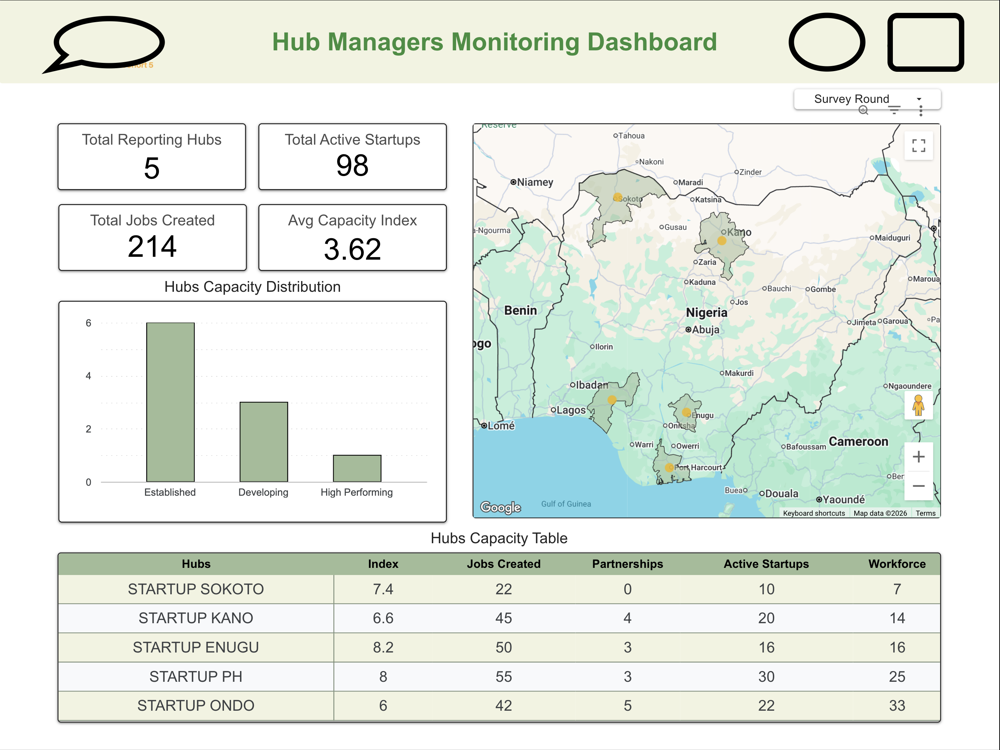

# Government Program Impact Analysis
Automated Monitoring and Evaluation analytics pipeline for tracking startup growth across program phases using BigQuery and Looker Studio.

# Executive Summary

This project documents the design and implementation of an automated Monitoring & Evaluation (M&E) system for a government startup support program in Nigeria.

The system tracks startup performance across baseline, midline, and endline phases, measuring key impact indicators such as revenue growth, job creation, partnerships, and ecosystem engagement.

Data is collected via Google Forms, processed and transformed in BigQuery, and visualized in Looker Studio dashboards. Scheduled queries automate longitudinal tracking, enabling real-time performance monitoring across cohorts and hubs.

The solution supports evidence-based decision-making by providing structured KPI tracking, automated reporting, and program-level impact analysis.

## Impact Indicators Tracked

- Tracked performance across 150+ startups and 37 innovation hubs
- Automated monitoring of 10+ key impact indicators
- Analyzed cohort across baseline, midline, and endline phases
- Reduced reporting turnaround time by approximately 70%
- 200+ Total Jobs Created
- 40% Revenue Growth (absolute & % change)
- 20+ Partnership Development
- Startup Survival & Growth Trends
- Cohort-Level Performance Comparison

## ⚠️‼️ Data Privacy & Confidentiality

This project was implemented for a government-backed program. Due to data sensitivity and confidentiality agreements, raw datasets and identifiable startup information cannot be shared publicly.

All examples provided are synthetic and for demonstration purposes only.

- [SQL Sample queries](SQL/pipeline.sql)
- Sample Monitring Dashboard
 
---

# Problem Statement

Manual reporting across cohorts made it difficult to track startup growth consistently and compare performance across program phases.

## M&E Framework Design
	•	Defined KPIs:
	•	Revenue Growth
	•	Jobs Created
	•	Strategic Partnerships
	•	Operational Growth Indicators
	•	Designed baseline, midline, endline tracking logic
	•	Standardized indicator definitions for consistency

## Data Architecture

Collection → Storage → Transformation → Visualization

```
Google Forms
    ↓
BigQuery (raw ingestion tables)
    ↓
Scheduled Queries (cleaning + KPI computation)
    ↓
Aggregated impact tables
    ↓
Looker Studio Dashboard (auto-refresh)
```

## Automation Logic 

- Scheduled BigQuery queries update KPI tables
- Cohort progress automatically recalculated
- Dashboard refreshes without manual intervention
- Longitudinal comparison across timepoints


